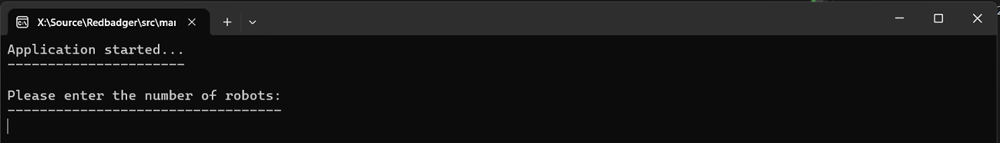
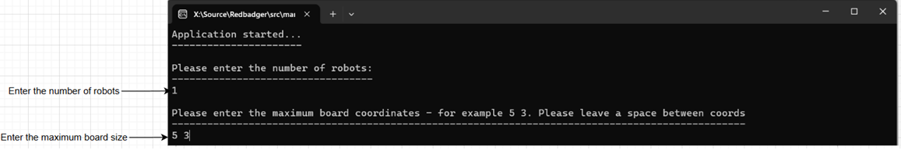
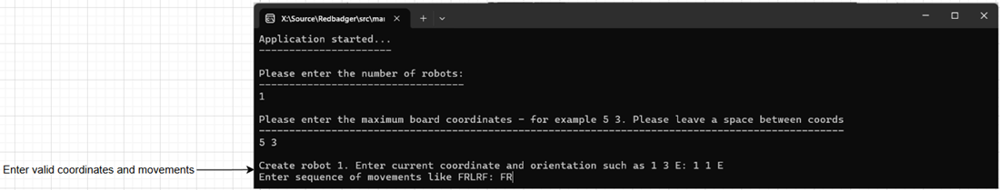
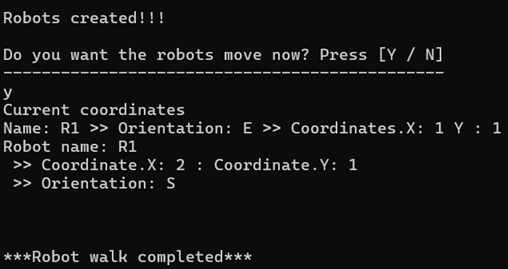

Mars Robots

1. Requirements
   1.1 Create a square of coordinates to represent the mars terrain.
   1.2 Start by entering the maximum size of the square.
   1.3 Enter the current robot coordinates + orientation
   1.4 Enter the movements the robot must take – RFLR
   1.5 Let the robot(s) walk.
   1.6 Mark the spot where the robot can go off the edge of the square.
   1.7 Let robots walk synchronously.

2. Constraints
   2.1 Maximum length of coordinates (x, y) is 50.
   2.2 Maximum length of the instruction is a 100 characters e.g 1 1 E FRRFRFL
   2.3 Add a constraint in movement – Movement can only be F – Forward, L – Left or R – Right

3. Implementation
   3.1 Start by setting the application variables to default values.
   3.2 The ‘UI’ in this case is a simple console application. On startup, it asks the user the following questions:
   3.2.1 Enter the number of robots that will walk the surface – this allows for a variable number of robots to create.
   3.2.2 Enter the coordinates of the maximum boards size.
   3.2.3 Enter the robot details which includes the robot name, coordinates and orientation.
   3.2.4 Enter the movements the robot must follow – FRL. This also allow to enter variable length of movements per robot
   3.3 The application will ask the user to execute the walk procedure for each of the robots.

4. Output
   The move method of each robot will take the movements, orientation and coordinates into account when performing the Takestep procedure which makes up the move method.
   Takestep procedure will also determine if the robot is falling of the edge of the surface. If the robot does fall over the edge, it will generate and print a robot scent coordinates. If not, it will print current coordinates after the walk is completed.

5. Design ideas
   5.1 Users can add a variable number of robots to walk.
   5.2 User can add variable movements per robot.
   5.3 Remove magic strings such as movements and orientation and add it to a constant class.
   5.4 Added unit tests to the mars_robots.Tests project.
   5.5 Add validations when creating coordinates and robot objects. Validate if required values are present and falls within valid ranges such Orientation and Movement.

6. Operations

6.1 Install dotnet 8 on computer.
6.2 Clone github repo and navigate to root folder.
6.3 In the same folder as the .sln file – open a terminal and type dotnet run.
6.4 This should restore, build and run the application.

6.5.1

fig 1. Enter number of robots

6.5.2

fig 2. Enter max board zide and robot count.

6.5.3

fig 3. Enter valid coorderinates and movements for each robot.

6.5.4

fig 4. Walk procedure completed
